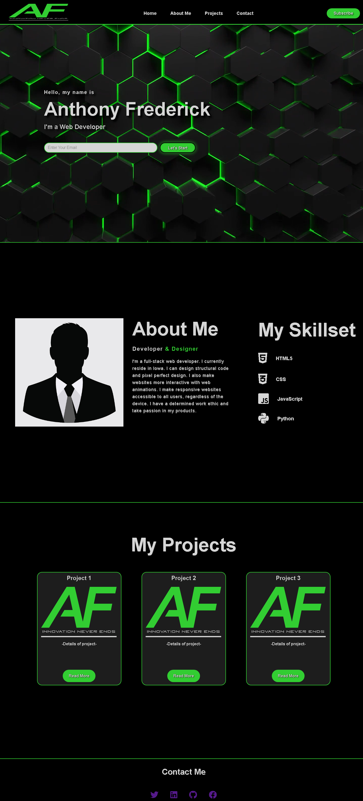

# Anthony Frederick's Portfolio

## Description

[Link to my portfolio](https://anthonyfrederick7.github.io/portfolio/)

  - My webpage was created for buisnesses/individuals to see my portfolio. The portfolio has a general introduction of myself, links to my social accounts, and projects I've worked on.

  - My webpage has a Home section introducing myself and allowing the viewer to input their email to contact me. It also has a navigation bar at the top to take you to the portion of the page you're looking for.

  - My webpage has an About Me section with a brief description and photo of myself. It also includes my background and skills/languages I have gathered.

  - My webpage has a Projects section with my best projects. Each project is in its own card with a name, picture, short description and link for each project.

  - My webpage has a Contact section with clickable icons that go to my social links.

## Installation

N/A

## Usage

  - The nav bar at the top of the page has 4 links (Home, About Me, Projects), upon clicking it'll take you to the section of the webpage you clicked on. The nav bar also has a subsribe button allowing you to support my work and recieve notifications from me. 

  - There is an option to enter an emial on the Home page to get in contact via email.

  - There is a button at the bottom of each project card in the Projects section, allowing you to view a more in depth description and functionality of my projects.

## Credits

  - https://github.com/AnthonyFrederick7

## Reference Links

  - https://www.w3schools.com/
  - https://developer.mozilla.org/

## License

N/A
